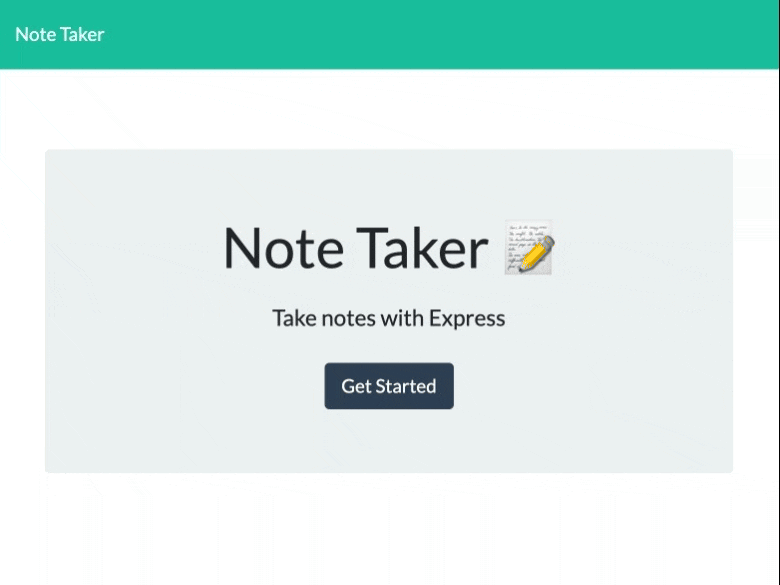

# express-noteBook
## UCB Bootcamp Module 11 Homework Challenge
This is my submission for the UCB Bootcamp Module 11 Homework Challenge.
This submission builds off of starter code provided by the bootcamp.
This starter code provides a front end.

My contribution can be summarized as building an Express.js back end to save and retrieve note data from a JSON database file. Specifics are as follows:
* The "fs" node module is used to handle storage and retrieval of notes with unique IDs from the "db.json" file
* 2 HTML navigation routes and 3 API data storage routes 
* Application is deployed to Heroku and loads with no errors

## Review
Heroku deployment: https://express-notebook-69e0a52ea5b2.herokuapp.com/
GitHub repository: https://github.com/jmariemo/express-noteBook

## GIF of page
